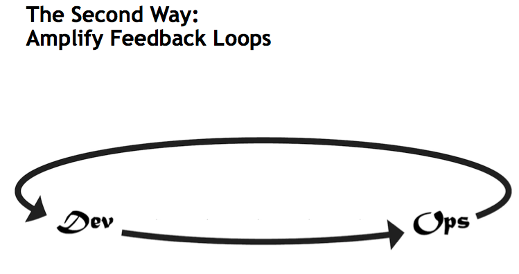
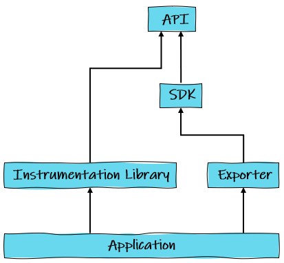

---
<!-- _class: lead -->
# Hi, I'm Joe :wave:
What's my background with Observability and OpenTelemetry?

---
## Outline
Our goal today is to answer these four questions:
- What is observability and why does it matters to world-class organizations?
- How is observability related to monitoring?
- What are the Three Pillars of Observability?
- What is the OpenTelemetry project and why would I want to use it?

---
<!-- _class: lead -->
# 1. What is observability and why does it matters to world-class organizations?

---
## Software systems are complex
- They are built on many layers, like a pile of Jenga blocks
- Reactive: respond to changes automatically (scale up/down/all around)
- Dynamic: run on all types of resources and are managed by orchestration systems
- Cross-functional: built and operated by multiple teams
---
## Observability: better visibility into systems
- Why: help you identify and solve problems faster ➡️ enables the business to move faster
- How: Monitoring, alerting, debugging
- What: signals like logs, metrics, traces (also exception trackers, profiling, ...)
---
## Observability helps you answer questions when things go wrong
- What went wrong?
- Why did it go wrong?
- Why is the system exhibiting this behavior?
- Is the service doing what users expect it to be doing?
- **Can you answer these questions without making code changes?**
---
## A way, not plug-n-play™️
- More about culture and practices than any one tool, like DevOps
- Non-functional requirement

[The Second Way: Amplify Feedback Loops](https://itrevolution.com/articles/the-three-ways-principles-underpinning-devops/)

<!--
The Second Way is about creating the right to left feedback loops. The goal of almost any process improvement initiative is to shorten and amplify feedback loops so necessary corrections can be continually made.

The outcomes of the Second Way include understanding and responding to all customers, internal and external, shortening and amplifying all feedback loops, and embedding knowledge where we need it.

https://itrevolution.com/articles/the-three-ways-principles-underpinning-devops/
-->

---
## What is a "world class" organization?
- Can **change** quickly to meet business needs
- Focus on providing on value to the customer
- Observability enables software and organizations to move fast and break _less_ things

> "Organizations with the highest service levels rebooted their servers twenty times less frequently than average... the best-performing organizations were much better at diagnosing and fixing service incidents."

— [The DevOps Handbook, pg 195](https://itrevolution.com/product/the-devops-handbook-second-edition/)

---
<!-- _class: lead -->
# 2. How is observability related to monitoring?
---
## How is observability related to monitoring?
- Observability ∈ monitoring
- Like Star Wars galaxy

---
<!-- _class: lead -->
# 3. What are the Three Pillars of Observability?
---
## Logs (1/3)
- The one we're all familiar with
- Timestamp, value (text, JSON, binary)
- \+ easy and familiar
- \- can lead to poor performance, especially if not async
- \- can be expensive to store if not handled properly, storage scales with usage
- \- system scoped (silod)

---

## Metrics (2/3)
- numerical representation of data measured over intervals of time
- Timestamp, value (numeric), name, labels
- [Golden Signals](https://sre.google/sre-book/monitoring-distributed-systems/#xref_monitoring_golden-signals) are a good place to start: latency, traffic, errors, saturation
- \+ mathematical properties allow for aggregation, prediction, summarization, etc.
- \+ good for alerting
- \+ storage does not scale with usage
- \- storage increases with cardinality (number of labels)

---
## Traces (3/3)
- provides context for a request across distributed architecture (end-to-end)
- globally unique ID that is passed through all parts of the system
- made up of "spans" — units of work
- \+ provides end-to-end observability of a request
- \- difficult to add to all aspects of the systems (1st party code, 3rd party code, frameworks, etc.)
- service meshes can provide this using proxies and sidecars
---
<!-- _class: lead -->

---
<!-- _class: lead -->
# 4. What is the OpenTelemetry project and why would I want to use it?
---
## What is OTel
- OpenTracing + OpenCensus ➡️ OpenTelemetry
- Open source
- Cloud Native Computing Foundation project — incubating
- Vendor-agnostic and tool-agnostic
- Tooling made up of
    - Language specific APIs/SDKs
    - OTel collectors for ingesting and exporting data to backends
    - OpenTelemetry Protocol (OTLP) — protocol for sending instrumentation data
---
<!-- _class: lead -->

[https://failingfast.io/opentelemetry/](https://failingfast.io/opentelemetry/)

---
## What is OTel — Instrumentation
- Automatic
    - \+ captures information for you by hooking into language and frameworks (e.g. Django, ASP.NET)
    - \- less granular
- Manual
    - \+ information captured can be customized as needed
    - \- have to setup yourself

---
## What is OTel — Collectors
- What makes up a collector?
    - Receivers: receive data in a variety of formats
    - Processors: aggregating, sampling, filtering, and processing
    - Exporters: send data to telemetry backends
- Don't _have_ to use one, but it's recommended

---
## A typical OTel setup

- Prometheus: OSS monitoring system and time series database
- Grafana: OSS analytics and monitoring solution with a focus on dashboards and alerts

---
## Why OTel?
- Vendor-agnostic
- Supported in most/all popular programming languages
- Can get started quickly
- Cloud platforms support it
- It is the future

---
## Azure

> Microsoft is excited to embrace OpenTelemetry as the future of telemetry instrumentation. [LINK](https://learn.microsoft.com/en-us/azure/azure-monitor/app/opentelemetry-overview#opentelemetry)

> we are refactoring Azure’s native observability platform to be based on OpenTelemetry, an industry standard for instrumenting applications and transmitting telemetry. [LINK](https://devblogs.microsoft.com/dotnet/azure-monitor-opentelemetry-distro/)

---
## Other Cloud Platforms
- [AWS Distro for OpenTelemetry (ADOT)](https://aws.amazon.com/otel/)
    - Secure, production-ready, open-source distribution with reliable performance
- [GCP Cloud Trace](https://cloud.google.com/trace/docs/setup)
    - "Cloud Trace recommends using OpenTelemetry."

---
## Closing
> Often, sheer force of effort can help a rickety system achieve high availability, but this path is usually short-lived and fraught with burnout and dependence on a small number of heroic team members. Taking a controlled, short-term decrease in availability is often a painful, but strategic trade for the long-run stability of the system.

— [SRE book](https://sre.google/sre-book/monitoring-distributed-systems/#the-long-run-MQsWTMS7)

---
<!-- _class: lead -->
## Demo (if time permits)

---
## Resources
- [Distributed Systems Observability book](https://www.oreilly.com/library/view/distributed-systems-observability/9781492033431/)
- [Observability Engineering book](https://learning.oreilly.com/library/view/observability-engineering/9781492076438/)
- [Google SRE — Monitoring Distributed Systems](https://sre.google/sre-book/monitoring-distributed-systems/)
- [Honeycomb — The Director's Guide to Observability](https://www.honeycomb.io/wp-content/uploads/2023/11/whitepaper_observability_for_TDM.pdf)
- [The Modern Observability Problem](https://failingfast.io/opentelemetry-observability/)
- [OpenTelemetry, The Missing Ingredient](https://failingfast.io/opentelemetry/)
- [Observing Python: An Introduction to OpenTelemetry Metrics](https://intellitect.com/blog/opentelemetry-metrics-python/)

---
<!-- _class: lead -->
# Questions 🎙️
